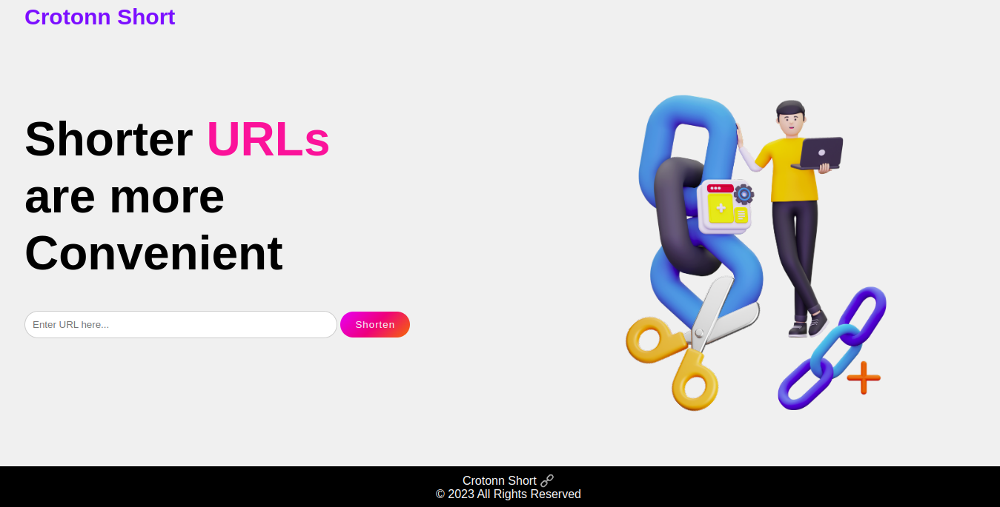

# crotonnshort.github.io

# Crotonn Short 

Crotonn Short is a simple and user-friendly web app that allows you to shorten long URLs with ease. 
The technology stack used here is only  HTML, CSS, and Vanilla JavaScript and leverages the Bitly API for URL shortening.

## Table of Contents

- [Features](#features)
- [Getting Started](#getting-started)
  - [Prerequisites](#prerequisites)
  - [Installation](#installation)
- [Usage](#usage)
- [API Integration](#api-integration)
- [Contributing](#contributing)
- [License](#license)

## Features

- 🖇️ Shorten long URLs quickly and efficiently.

- ⚡ User-friendly interface with a clean and minimal design.

- Asynchronous interaction with the Bitly API.

- ❌ Error handling for invalid URLs and API errors.

- Single-page web app with no page redirects.

- 🎧 Event listeners for seamless user interaction.

## 🚀 Getting Started

Follow the instructions below to get your copy of Crotonn Short up and running.

### ✅️✅️✅️Prerequisites

Before you begin, you'll need the following:

- 🔐 A Bitly account and API key🔑 (access token). 
You can obtain one by following Bitly's registration process which involves signing up to their site and creating a Developer Account. You should then generate an access token, or an API Key which you will use for your desired app.
The screenshot below shows you the right page you should be at.

### 🛠️ 🛠️ 🛠️ Installation

1. Clone the repository to your local machine:
👨‍💻
On the green icon indicated as code, click on the copy icon while ensuring that you have selected either SSH or HTTPS depending on your preference.
Run the following command when you have moved to the directory you wish to store your project.
git clone https://github.com/your-username/crotonn-short.git

To launch the app, open the code in your desired code editor. 
Launch the app on the browser.

🌐 🌐 🌐 🌐 🌐 🌐 🌐 🌐 🌐 🌐

The final result should look like the screenshot below...

🤺 🤺 🤺 
This project is protected under the MIT License...

Copyright © 2023 Crotonn Short
